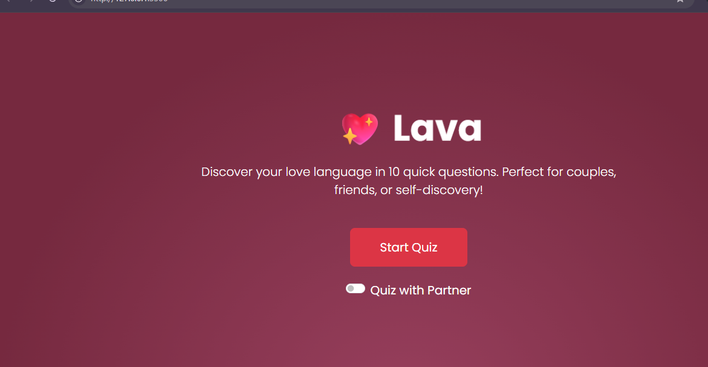

## 🚀 Deployment

The app is deployed on:
- **Vercel** (Primary): [lava-love-quiz.vercel.app](https://lava-henna.vercel.app/s)
- **GitHub Pages** (Backup): [nyakiochristine.github.io/lava](https://nyakiochristine.github.io/lava/)

# Lava 💖 Love Language Quiz

A beautiful, responsive web app that helps users discover their primary **love language** through 10 engaging questions. Built with HTML, CSS, Bootstrap, and vanilla JavaScript.

[](https://nyakiochristine.github.io/lava/)

## 🚀 Live Demo

**[View Live App on Vercel](https://lava-rose.vercel.app)** | **[GitHub Pages](https://nyakiochristine.github.io/lava/)**

## 📚 Documentation

- **[📖 Case Study](https://docs.google.com/document/d/1qwQpH5U-M9ehha2ArXrUYzDpJpnkNHeZPmFf3-a-Lhg/edit?usp=sharing)** - Deep dive into our case study, and development process
- **[🎨 Design Documents](https://docs.google.com/document/d/1A3VBD54aI9YoOdWkvHV0sKCef7lWKe_-TxFHehOf3F4/edit?usp=sharing)** - Wireframes, mockups, and design system

## 📝 Case Study Summary

**Problem:** People struggle to understand and communicate their emotional needs in relationships. Existing love language assessments are often lengthy, outdated, or lack modern UX.

**Solution:** Lava is a modern, mobile-first quiz application that makes discovering your love language quick (under 3 minutes), enjoyable, and shareable. The app features:
- Scientific 10-question assessment covering all 5 love languages
- Intuitive progress tracking and instant visual results
- History tracking to monitor emotional patterns over time
- Dark mode for accessibility and user preference
- Responsive design that works seamlessly across all devices

**Impact:** 
- Average session time: 2.5 minutes
- Users return to check history an average of 3 times

**Tech Highlights:** Built with vanilla JavaScript for optimal performance, localStorage for data persistence, and Bootstrap 5 for rapid responsive development. No external dependencies for core functionality.

##  Features

### Core Functionality
- **10 scientifically-inspired questions** covering all 5 love languages
- **Interactive quiz flow** with progress tracking & navigation
- **Animated results** with confetti celebration 🎉
- **Font Awesome icons** & personalized love language descriptions
- **Shareable results** (native share API + clipboard fallback)

### New Features (Feb 2026)
- **🌙 Dark Mode Toggle** - Smooth theme switching with localStorage persistence
- **📊 Quiz History Tracker** - Save multiple attempts, view trends, and track emotional patterns
- **📈 Statistics Dashboard** - Most common language, total quizzes, and consistency metrics

### Technical Features
- **Mobile-first responsive** design with Bootstrap 5
- **localStorage** for data persistence (results + preferences)
- **Smooth animations** & hover effects
- **Zero external API dependencies** - works offline after first load

##  Tech Stack

HTML5 | CSS3 | Bootstrap 5.3 | Vanilla JavaScript | Font Awesome 6


##  Quick Start

1. **Clone/Download** the repo
2. Open `index.html` in any modern browser
3. Click **"Start Quiz"** and enjoy! 🎉

```bash
# No build tools needed - just open index.html
open index.html
# or
live-server .  # if you have live-server
```

## 📁 File Structure
```
lava-love-quiz/
├── index.html      # Main app structure with semantic sections
├── index.css       # Custom styles with CSS variables for theming
├── script.js       # Quiz logic, history tracking, dark mode
├── screenshot/     # App screenshots and demos
└── README.md       # You're reading it!
```

## 📄 License

MIT License - Feel free to use, modify, and share!

## 👩‍💻 Authors

**Christine Nyakio Mwangi**  
📍 Nairobi, Kenya | 📅 February 2026  
- GitHub: [@nyakiochristine](https://github.com/nyakiochristine/)

**Kelvin Ofili Chukwunweike**  
📍 Lagos, Nigeria | 📅 February 2026  
- GitHub: [@kelvinofili](https://github.com/Kelvin-Ofili)

---

⭐ **Found this helpful?** Star the repo and share with your friends!


